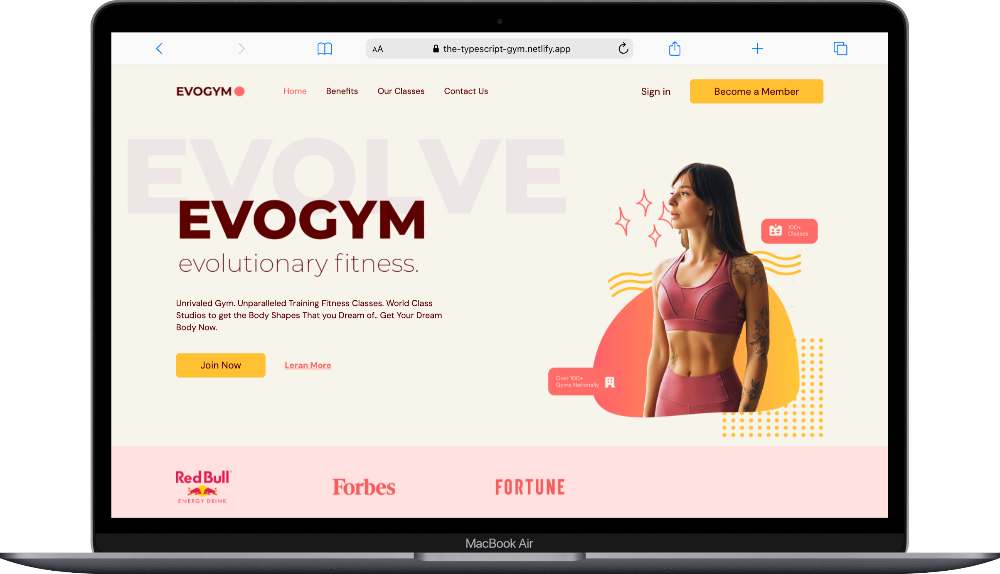
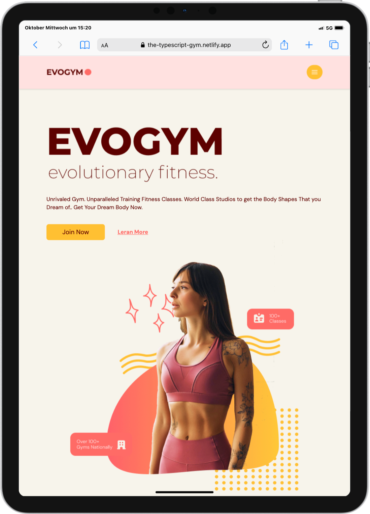
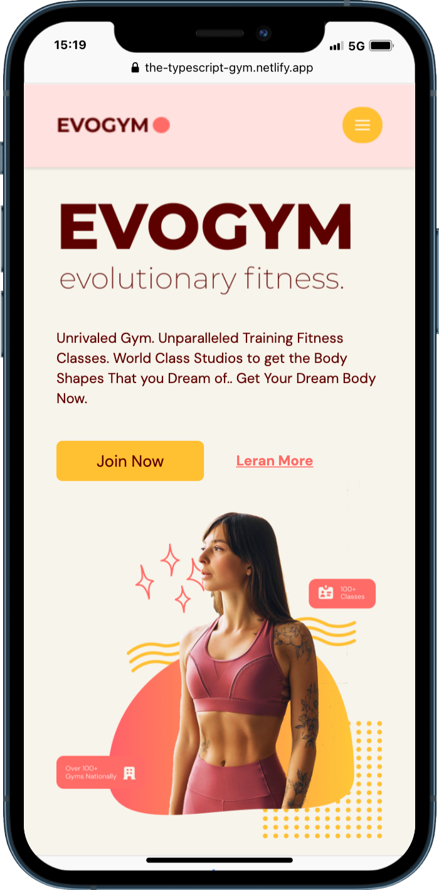

# Typescript Gym 🏋️

  

 

This is a straightforward practice project designed to showcase the capabilities of React, TypeScript, Framer Motion, and Tailwind CSS. By combining these powerful tools, I've created an interactive and visually appealing user interface. It's a project provided by engineer and youtuber EdRoh.

## Table of Contents 📑

-   [About](#about)
-   [Tech Stack](#tech-stack)
-   [Deployment](#deployment)

## About

This project was undertaken to practice and solidify my skills in TypeScript and React. The goal was to create a flexible and responsive website that could serve as a fitness website for a company.

Through this project, I was able to gain valuable hands-on experience with TypeScript and React, as well as explore the capabilities of Framer Motion

    
    

## Tech Stack

**Markup:**  
  
**Styling:**  

  
**Library:**  
  
**Animation:**  
  
**IDE:**  
  
**Version Control:**  

## Deployment

The "Typescript Gym" project is deployed using Netlify, making it easily accessible to everyone
The live version of "Typescript Gym" can be accessed here:

https://the-typescript-gym.netlify.app/
